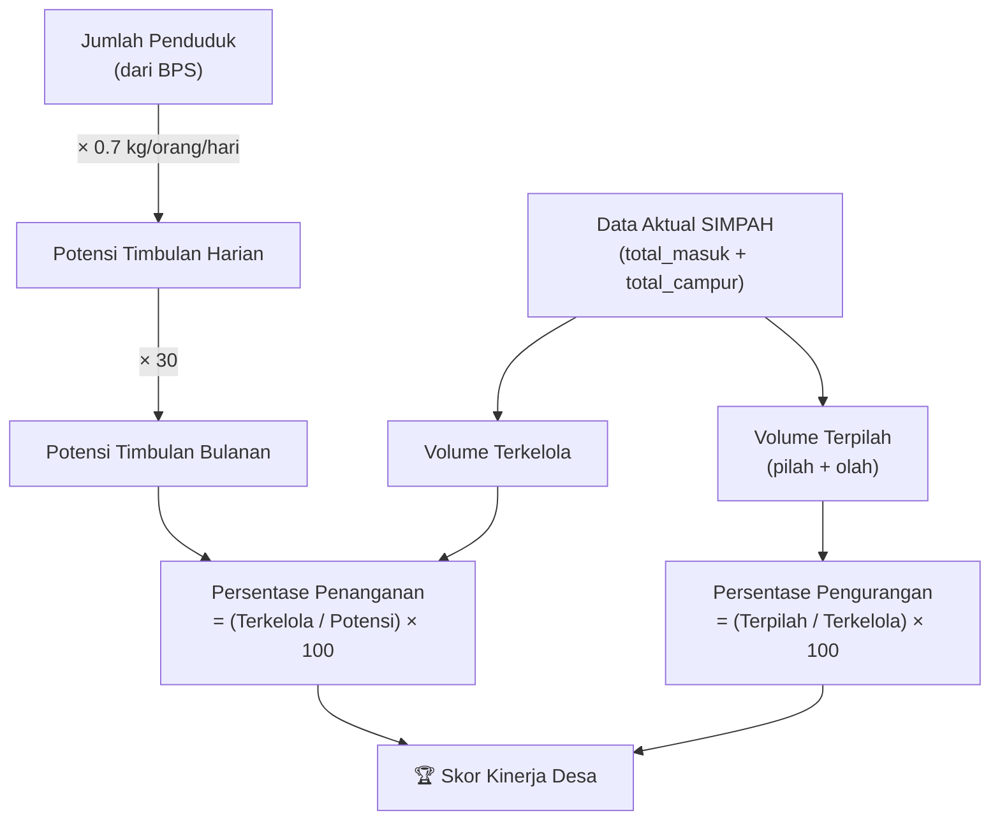

# Analisis Fitur: Data Penduduk & Persentase Keberhasilan per Desa

## Feedback UAT
> *"User ingin menampilkan jumlah penduduk yang memungkinkan potensi timbulan sampah, jadi setiap desa mengakumulasi kinerja dan persentase keberhasilan."*

---

## Kondisi Saat Ini

Sistem SIMPAH saat ini sudah punya fondasi yang kuat:

| Komponen | Status | Catatan |
|----------|--------|---------|
| Profil per Wilayah/Desa | ✅ Ada | `village-stats.js` sudah mengagregasi data per wilayah |
| Skor Performa (0-100) | ✅ Ada | `calculateVillageScore()` di `intervention-rules.js` |
| Recycling Rate | ✅ Ada | `(pilah + olah) / (masuk + campur) × 100` |
| Estimasi Penduduk (KK) | ⚠️ Fiktif | `estimated_kk = 200 + record_count × 5` — ini placeholder! |
| Timbulan per KK | ⚠️ Berdasarkan data fiktif | Karena KK-nya estimasi kasar |
| Ranking Intervensi | ✅ Ada | Tabel ranking + profil detail per desa |

> [!WARNING]
> **Masalah utama**: Data penduduk saat ini **dibuat-buat** (line 177 `village-stats.js`). Ini bukan data nyata dari BPS/Disdukcapil.

---

## Pendapat Saya: Sangat Feasible & Bernilai Tinggi 🎯

Ini fitur yang sangat bagus karena:

1. **Rumus Standar KLHK sudah ada** — Timbulan per kapita per hari = **0.7 kg/orang/hari** (standar nasional)
2. **Menjadikan scoring lebih bermakna** — Skor saat ini hanya berdasarkan recycling rate, residu, dan aduan. Dengan data penduduk, kita bisa menghitung **gap antara potensi vs realita**
3. **Decision support yang kuat** — Desa A dengan 5000 penduduk tapi baru mengelola 20% timbulan → prioritas intervensi tinggi

## Desain Fitur

### Data Input: Tabel `village_population` (Supabase)

```sql
CREATE TABLE village_population (
  id UUID PRIMARY KEY DEFAULT gen_random_uuid(),
  kecamatan TEXT NOT NULL,           -- Nama Kecamatan
  desa TEXT NOT NULL,                 -- Nama Desa/Kelurahan
  jumlah_penduduk INT NOT NULL,       -- Jiwa (dari BPS/Disdukcapil)
  jumlah_kk INT NOT NULL,            -- Kepala Keluarga
  luas_km2 NUMERIC(8,2),             -- Luas wilayah (km²)
  tahun_data INT DEFAULT 2025,        -- Tahun sumber data
  updated_at TIMESTAMPTZ DEFAULT now()
);
```

### Rumus Perhitungan



### Metrik Baru yang Akan Ditampilkan

| Metrik | Rumus | Target KLHK |
|--------|-------|-------------|
| **Potensi Timbulan** | Penduduk × 0.7 kg/hari | — |
| **% Penanganan** | Volume Terkelola / Potensi × 100 | ≥ 70% |
| **% Pengurangan** | Volume Terpilah / Terkelola × 100 | ≥ 30% |
| **Timbulan per Kapita** | Total Masuk / Penduduk / Hari | ≤ 0.7 kg |
| **Gap Penanganan** | Potensi − Terkelola | Mendekati 0 |
| **Kepadatan Layanan** | Penduduk / Jumlah Fasilitas | ≤ 2500 jiwa/unit |

### UI: Kolom Baru di Ranking Table

Tabel Intervensi akan ditambah kolom:

| Rank | Wilayah | **Penduduk** | **Potensi (kg/bln)** | **Terkelola** | **% Penanganan** | **% Pengurangan** | Skor | Status |
|------|---------|-------------|---------------------|---------------|-----------------|-------------------|------|--------|
| 1 | Banjarnegara | 45,320 | 951,720 | 285,000 | 29.9% 🔴 | 15.2% 🟡 | 38 | Prioritas |
| 2 | Mandiraja | 32,100 | 674,100 | 450,000 | 66.8% 🟡 | 28.5% 🟡 | 55 | Perhatian |
| 3 | Purwareja | 28,500 | 598,500 | 480,000 | 80.2% 🟢 | 35.1% 🟢 | 78 | Baik |

### UI: Profil Detail — Section Baru "Demografi & Potensi"

```
┌─────────────────────────────────────────────┐
│  👥 Demografi & Potensi Timbulan            │
├─────────────────────────────────────────────┤
│  Penduduk: 45,320 jiwa (11,330 KK)         │
│  Luas: 24.5 km²                            │
│  Kepadatan: 1,849 jiwa/km²                 │
│                                             │
│  ┌──────────────────────────────────┐       │
│  │ Potensi Timbulan   │ 31,724 kg/hr │       │
│  │ Volume Terkelola   │  9,500 kg/hr │       │
│  │ Gap Penanganan     │ 22,224 kg/hr │       │
│  │ % Penanganan       │    29.9% 🔴  │       │
│  │ % Pengurangan      │    15.2% 🟡  │       │
│  └──────────────────────────────────┘       │
│                                             │
│  ████████░░░░░░░░░░░░░░░░░ 29.9%           │
│  Penanganan      Target ≥70% ──────┘       │
└─────────────────────────────────────────────┘
```

---

## Rencana Implementasi

### Phase 1: Data Penduduk (Supabase)
1. Buat tabel `village_population` di Supabase
2. Isi data penduduk Kab. Banjarnegara (20 kecamatan, ~200 desa)
3. Tambah menu input data penduduk di Master Data dashboard

### Phase 2: Kalkulasi (Frontend)
4. Update `village-stats.js` — ganti `estimated_kk` dengan data real dari Supabase
5. Tambah metrik baru: potensi timbulan, % penanganan, % pengurangan, gap
6. Update `calculateVillageScore()` — integrasikan % penanganan ke skor

### Phase 3: UI (Dashboard)
7. Update tabel ranking di `intervensi.js` — tambah kolom baru
8. Update profil detail — tambah section "Demografi & Potensi"
9. Tambah traffic light indicator untuk % penanganan dan % pengurangan

### Phase 4: Rules (Opsional)
10. Tambah intervention rules baru untuk gap penanganan tinggi
11. Tambah rules untuk kepadatan layanan (penduduk per fasilitas)

---

## Pertanyaan untuk Anda

> [!IMPORTANT]
> 1. **Data penduduk** — Apakah Anda punya data penduduk per desa/kecamatan di Banjarnegara? (bisa dari BPS atau Disdukcapil)
> 2. **Scope** — Mau langsung implementasi semua phase, atau mulai dari data penduduk dulu?
> 3. **Angka timbulan** — Standar nasional 0.7 kg/orang/hari. Apakah ada angka lokal dari DLH Banjarnegara yang lebih spesifik?
