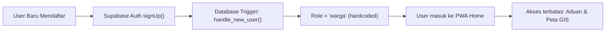
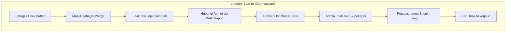
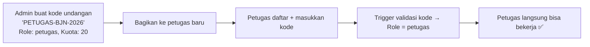
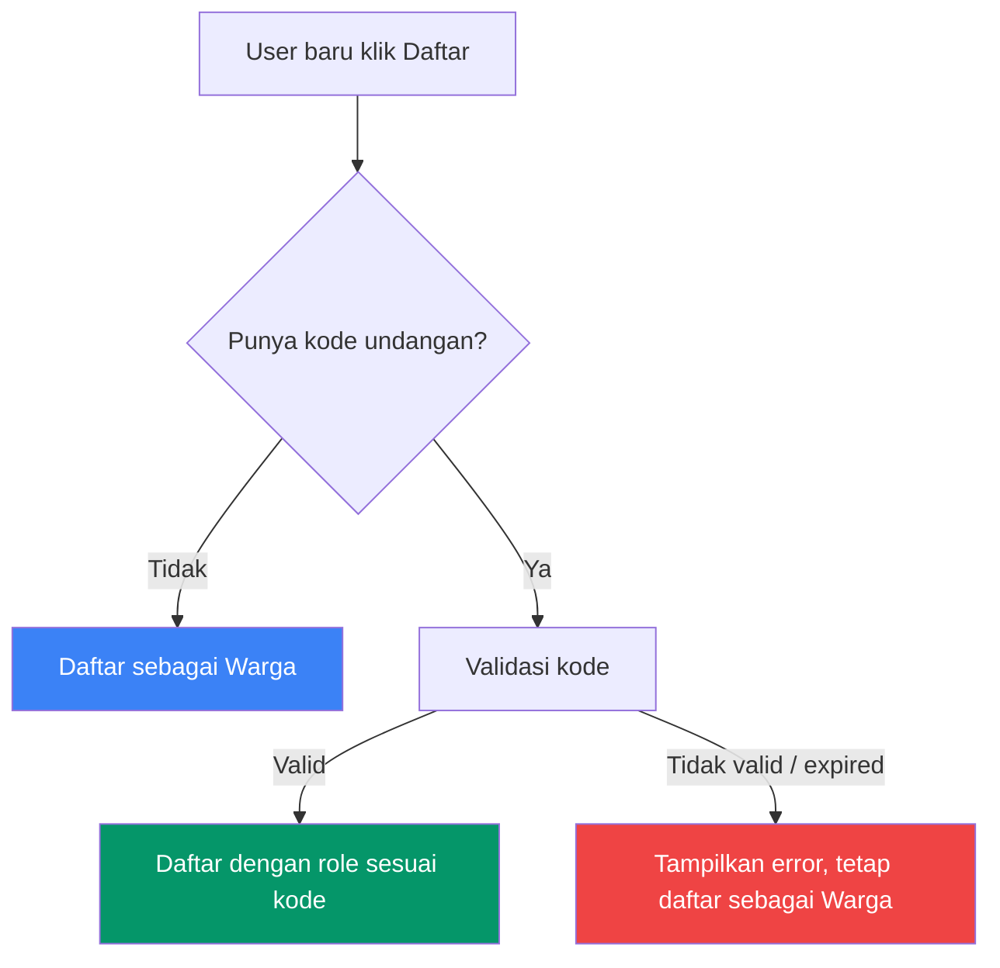

# Analisis & Saran: Pengelolaan Role pada Pendaftaran User Baru SIMPAH

## Perspektif: Product Manager & Business Analyst

---

## 1. Kondisi Saat Ini (As-Is)

| Aspek | Detail |
|---|---|
| **Default Role** | `warga` — di-hardcode di database trigger, tidak bisa dimanipulasi dari client |
| **Keamanan** | ✅ Baik. [fix_rbac_and_rls.sql](file:///U:/Project/simpah-rilis%20v1/docs/fix_rbac_and_rls.sql#L14-L26) mengabaikan metadata `role` dari client |
| **Promosi Role** | Hanya bisa dilakukan oleh Admin melalui halaman [Master Data → Pengguna](file:///U:/Project/simpah-rilis%20v1/src/pages/dashboard/masterdata.js) |
| **Halaman Registrasi** | Form standar: Nama, Username, Email, Password — tanpa pilihan role ([register.js](file:///U:/Project/simpah-rilis%20v1/src/pages/register.js)) |

---

## 2. Peta Masalah (Problem Statement)

### 🔴 Masalah Utama: Bottleneck Onboarding untuk Non-Warga

Semua user yang mendaftar — baik **warga biasa**, **petugas lapangan yang baru direkrut**, maupun **pejabat eksekutif** — akan selalu masuk sebagai `warga`. Ini menciptakan beberapa friction:

| # | Masalah | Dampak Bisnis | Severity |
|---|---|---|---|
| 1 | **Petugas baru tidak bisa langsung bekerja** setelah mendaftar | Delay operasional harian: Input sampah, pilah, olah tertunda sampai admin mempromosikan role | 🔴 High |
| 2 | **Eksekutif/pejabat harus menunggu admin** untuk bisa melihat dashboard | Pengalaman buruk bagi stakeholder level tinggi; kesan sistem tidak siap pakai | 🔴 High |
| 3 | **Admin menjadi single point of failure** | Jika admin sedang tidak tersedia (cuti, sibuk), seluruh onboarding terhenti | 🟡 Medium |
| 4 | **Tidak ada notifikasi ke admin** saat ada user baru yang mendaftar | Admin tidak tahu ada user yang perlu di-assign role-nya | 🟡 Medium |
| 5 | **Skalabilitas terbatas** saat jumlah user meningkat | Jika 50 petugas mendaftar bersamaan di deployment baru, admin harus edit satu per satu | 🟡 Medium |

> [!IMPORTANT]
> Dari sisi **keamanan**, perilaku default `warga` sudah **benar dan aman**. Masalahnya bukan di security, melainkan di **efisiensi operasional** dan **user experience** onboarding.

---

## 3. Analisis Stakeholder & Journey

**Temuan kunci:** Ada **7 langkah** dan **ketergantungan pada komunikasi informal** (WA/telepon) sebelum petugas bisa mulai bekerja. Ini bukan proses yang scalable.

---

## 4. Opsi Solusi yang Direkomendasikan

### Opsi A: Sistem Kode Undangan (Invitation Code) — ⭐ Direkomendasikan

**Konsep:** Admin membuat kode undangan per role. Petugas/eksekutif memasukkan kode saat mendaftar untuk langsung mendapat role yang sesuai.

| Pro | Kontra |
|---|---|
| ✅ User langsung mendapat role yang benar | ❌ Perlu pengembangan fitur baru |
| ✅ Tetap aman — kode dikendalikan admin | ❌ Perlu manajemen kode (expire, kuota) |
| ✅ Skalabel: 1 kode bisa dipakai banyak petugas | |
| ✅ Admin tidak perlu online saat pendaftaran | |

#### Perubahan Teknis yang Dibutuhkan:

| Layer | Perubahan |
|---|---|
| **Database** | Tabel baru `invitation_codes` (code, role, quota, expires_at, created_by) |
| **Trigger** | Modifikasi `handle_new_user()` untuk cek metadata `invitation_code` → lookup role |
| **Frontend** | Tambah field opsional "Kode Undangan" di [register.js](file:///U:/Project/simpah-rilis%20v1/src/pages/register.js) |
| **Admin Panel** | Tab baru di [masterdata.js](file:///U:/Project/simpah-rilis%20v1/src/pages/dashboard/masterdata.js) untuk CRUD kode undangan |

---

### Opsi B: Approval Queue (Antrian Persetujuan)

**Konsep:** User mendaftar dan memilih "role yang diinginkan". Pendaftaran berstatus *pending* sampai admin menyetujui.

| Pro | Kontra |
|---|---|
| ✅ Kontrol penuh oleh admin | ❌ User tetap harus menunggu approval |
| ✅ Audit trail jelas | ❌ Lebih kompleks — perlu notifikasi, queue management |
| ✅ Cocok untuk organisasi formal (dinas) | ❌ Tidak menyelesaikan bottleneck sepenuhnya |

---

### Opsi C: Admin Bulk Registration (Pendaftaran Massal oleh Admin)

**Konsep:** Admin mendaftarkan akun petugas/eksekutif secara batch dari halaman Master Data, termasuk langsung menetapkan role.

| Pro | Kontra |
|---|---|
| ✅ Sangat aman — user biasa tidak bisa pilih role | ❌ Admin harus tahu data semua petugas sebelumnya |
| ✅ Bisa dibuat seeder/import CSV | ❌ Petugas tidak bisa self-register |
| ✅ Cocok untuk deployment awal | ❌ Tidak scalable untuk pertumbuhan organik |

---

### Opsi D: Hybrid — Invitation Code + Self-Register (⭐⭐ Paling Lengkap)

**Konsep:** Gabungan terbaik:
1. **Warga** → Self-register (seperti sekarang, tanpa kode)
2. **Petugas/Eksekutif** → Self-register dengan kode undangan
3. **Admin** → Hanya bisa dibuat oleh admin lain dari Master Data

---

## 5. Rekomendasi Akhir

> [!TIP]
> **Rekomendasi utama: Opsi D (Hybrid Invitation Code + Self-Register)**
> 
> Opsi ini memberikan keseimbangan terbaik antara **keamanan**, **kemudahan onboarding**, dan **skalabilitas**. Warga tetap bisa mendaftar bebas, sementara role-role operasional dikontrol melalui kode undangan yang dikelola admin.

### Prioritas Implementasi (Roadmap)

| Fase | Fitur | Effort | Prioritas |
|---|---|---|---|
| **Sprint 1** | Field "Kode Undangan" opsional di form registrasi + tabel `invitation_codes` | 🟢 Small | P0 |
| **Sprint 1** | Tab "Kode Undangan" di Master Data (Admin CRUD) | 🟡 Medium | P0 |
| **Sprint 1** | Modifikasi trigger `handle_new_user()` untuk validasi kode | 🟢 Small | P0 |
| **Sprint 2** | Notifikasi ke admin saat ada user baru mendaftar | 🟡 Medium | P1 |
| **Sprint 2** | Expiry otomatis & kuota pemakaian kode | 🟢 Small | P1 |
| **Sprint 3** | Admin bulk import user via CSV | 🟡 Medium | P2 |

### KPI Keberhasilan

| Metrik | Target | Cara Ukur |
|---|---|---|
| Time-to-productive untuk petugas baru | < 5 menit (dari daftar → bisa input) | Log timestamp registrasi vs first action |
| Beban admin untuk onboarding | Berkurang 80% | Jumlah edit role manual per bulan |
| Tingkat kesalahan role assignment | 0% | Audit log perubahan role |

---

## 6. Risiko & Mitigasi

| Risiko | Mitigasi |
|---|---|
| Kode undangan bocor ke pihak tidak berwenang | Set expiry date + kuota pemakaian + kemampuan admin menonaktifkan kode |
| User salah memasukkan kode → jadi warga | Pesan error yang jelas + kemudahan admin untuk promosi role retroaktif |
| Backward compatibility dengan user existing | Tidak ada dampak — fitur kode undangan bersifat opsional |
