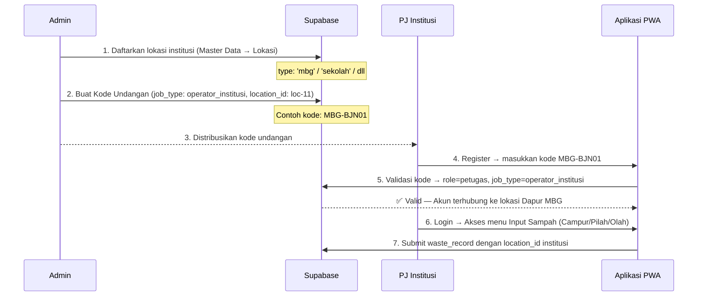

# Dukungan Input Sampah untuk Institusi (MBG / Sekolah / Perkantoran / Pesantren)

## Latar Belakang

Saat ini SIMPAH hanya mendukung 4 `job_type` petugas: `koordinator`, `angkut`, `operator_tps`, `kader`. Institusi seperti MBG (Makan Bergizi Gratis), sekolah, perkantoran, dan pesantren **tidak bisa** mendaftar maupun menginput data sampah karena:

1. Tidak ada `job_type` yang mewakili mereka
2. Tidak ada tipe lokasi institusi di `LOCATION_TYPES`
3. Form input sampah PWA hanya mengenali fasilitas `tps3r`, `bank_sampah`, `pengepul`

**Pendekatan:** Memanfaatkan sistem **Kode Undangan** yang sudah ada sepenuhnya — Admin cukup membuat kode undangan dengan `job_type` baru dan mendaftarkan lokasi institusi.

---

## User Review Required

> [!IMPORTANT]
> **Job type baru `operator_institusi`** — Apakah semua jenis institusi (MBG, sekolah, kantor, pesantren) cukup digabung ke satu `job_type` ini? Atau perlu dipecah jadi `operator_mbg`, `operator_sekolah`, dll? Rekomendasi saya: **satu `job_type` saja** (`operator_institusi`), karena perbedaan antar-institusi cukup ditandai lewat `type` di tabel `locations`.

> [!IMPORTANT]
> **Hak akses input** — Untuk `operator_institusi`, apakah mereka bisa input **Campur + Pilah + Olah** (sama seperti `operator_tps`)? Atau hanya **Campur** saja? Rekomendasi saya: **sama seperti `operator_tps`** (masuk, pilah, olah) agar mendorong pemilahan dan pengolahan di institusi.

## Open Questions

> [!NOTE]
> **Label badge fasilitas:** Saat `operator_tps` membuka form input, muncul badge "Lokasi Fasilitas TPS3R / Pengolahan". Untuk institusi, badge ini akan menjadi "Lokasi Institusi" dengan emoji 🏫 (bukan 🏭). Apakah ini sudah tepat?

---

## Proposed Changes

### 1. Konstanta & Konfigurasi

#### [MODIFY] [sipsn.js](file:///U:/Project/simpah-rilis%20v1/src/utils/sipsn.js)

Tambahkan 4 tipe lokasi institusi ke `LOCATION_TYPES`:

```diff
 export const LOCATION_TYPES = [
   { id: 'tps', label: 'TPS', color: '#f59e0b', icon: icons.mapPin },
   { id: 'tps3r', label: 'TPS3R', color: '#10b981', icon: icons.recycle },
   { id: 'bank_sampah', label: 'Bank Sampah', color: '#3b82f6', icon: icons.briefcase },
   { id: 'pengepul', label: 'Pengepul', color: '#8b5cf6', icon: icons.truck },
-  { id: 'tpa', label: 'TPA', color: '#ef4444', icon: icons.map }
+  { id: 'tpa', label: 'TPA', color: '#ef4444', icon: icons.map },
+  { id: 'mbg', label: 'Dapur MBG', color: '#f97316', icon: icons.heart },
+  { id: 'sekolah', label: 'Sekolah', color: '#06b6d4', icon: icons.users },
+  { id: 'perkantoran', label: 'Perkantoran', color: '#6366f1', icon: icons.briefcase },
+  { id: 'pesantren', label: 'Pesantren', color: '#84cc16', icon: icons.star }
 ];
```

---

### 2. Sistem Permission (RBAC)

#### [MODIFY] [permissions.js](file:///U:/Project/simpah-rilis%20v1/src/utils/permissions.js)

**a) Tambah `operator_institusi` ke daftar `JOB_TYPES`:**

```diff
 export const JOB_TYPES = [
   { id: 'koordinator',  label: 'Koordinator Lapangan',       desc: 'Pengawas dan verifikator data lapangan' },
   { id: 'angkut',       label: 'Petugas Angkut',             desc: 'Sopir/petugas pengangkutan sampah' },
   { id: 'operator_tps', label: 'Operator TPS3R/Bank Sampah', desc: 'Petugas pengelola fasilitas TPS/Bank Sampah' },
   { id: 'kader',        label: 'Kader Lingkungan',            desc: 'Penggerak lingkungan tingkat RT/RW' },
+  { id: 'operator_institusi', label: 'Operator Institusi', desc: 'Petugas pengelola sampah institusi (MBG/Sekolah/Kantor/Pesantren)' },
 ];
```

**b) Tambah case `operator_institusi` di `getAllowedInputTypes()`:**

```diff
   switch (user.job_type) {
     case 'koordinator':
       return [];
     case 'angkut':
       return ['masuk', 'armada'];
     case 'operator_tps':
       return ['masuk', 'pilah', 'olah'];
     case 'kader':
       return ['masuk', 'pilah', 'olah', 'insidental'];
+    case 'operator_institusi':
+      return ['masuk', 'pilah', 'olah'];
     default:
       return ['masuk', 'pilah', 'olah', 'armada', 'insidental'];
   }
```

---

### 3. Form Input Sampah PWA — Mengenali Institusi

Perubahan ini perlu diterapkan di **3 file form input** yang memiliki pola `isOperatorTPS` yang identik. Perubahan di ketiganya sama persis.

#### [MODIFY] [input-sampah.js](file:///U:/Project/simpah-rilis%20v1/src/pages/pwa/input-sampah.js)
#### [MODIFY] [input-pilah.js](file:///U:/Project/simpah-rilis%20v1/src/pages/pwa/input-pilah.js)
#### [MODIFY] [input-olah.js](file:///U:/Project/simpah-rilis%20v1/src/pages/pwa/input-olah.js)

**a) Tambah deteksi `isOperatorInstitusi` di samping `isOperatorTPS`:**

```diff
   const isOperatorTPS = user?.role === 'petugas' && user?.job_type === 'operator_tps' && userFacility;
+  const isOperatorInstitusi = user?.role === 'petugas' && user?.job_type === 'operator_institusi' && userFacility;
   const isKader = user?.role === 'petugas' && user?.job_type === 'kader' && userDesa;
-  const isLockedLocation = isOperatorTPS || isKader;
+  const isLockedLocation = isOperatorTPS || isOperatorInstitusi || isKader;
```

**b) Tampilkan badge fasilitas institusi (di samping badge TPS3R yang sudah ada):**

Setelah blok `${isOperatorTPS && userFacility ? ...}`, tambahkan:

```diff
+        ${isOperatorInstitusi && userFacility ? `
+          <div class="tps-facility-badge" style="display:flex; align-items:center; gap:var(--space-3); padding:var(--space-3) var(--space-4); border-radius:var(--radius-lg); background:rgba(6,182,212,0.08); border:1px solid rgba(6,182,212,0.25); margin-bottom:var(--space-4);">
+            <div style="width:36px; height:36px; border-radius:8px; background:#0891b2; color:#fff; display:flex; align-items:center; justify-content:center; font-size:18px; flex-shrink:0;">
+              🏫
+            </div>
+            <div>
+              <div style="font-size:11px; color:var(--text-muted); font-weight:700; text-transform:uppercase; letter-spacing:0.5px;">Lokasi Institusi</div>
+              <div style="font-size:var(--font-sm); font-weight:700; color:var(--primary-800, #065f46); margin-top:1px;">${userFacility.name}</div>
+              <div style="font-size:var(--font-xs); color:var(--text-secondary);">Desa ${userDesa ? userDesa.desa_kelurahan : '-'}, Kec. ${userDesa ? userDesa.kecamatan : '-'}</div>
+            </div>
+          </div>
+        ` : ''}
```

**c) Filter dropdown fasilitas — Izinkan tipe institusi muncul:**

Perubahan pada fungsi `updateLocationDropdown()` atau filter `.includes(l.type)`:

```diff
-  const filteredLocs = locations.filter(l =>
-    (l.desa_id === selectedDesaId || ...) &&
-    ['tps3r', 'bank_sampah', 'pengepul'].includes(l.type)
-  );
+  const filteredLocs = locations.filter(l =>
+    (l.desa_id === selectedDesaId || ...) &&
+    ['tps3r', 'bank_sampah', 'pengepul', 'mbg', 'sekolah', 'perkantoran', 'pesantren'].includes(l.type)
+  );
```

---

### 4. PWA Home & Sampah Hub — Mengenali Job Type Baru

#### [MODIFY] [home.js](file:///U:/Project/simpah-rilis%20v1/src/pages/pwa/home.js)

**a) Tambah `operator_institusi` ke daftar `isInputter`:**

```diff
-  const isInputter = user.role === 'petugas' && ['kader', 'operator_tps', 'angkut'].includes(user.job_type);
+  const isInputter = user.role === 'petugas' && ['kader', 'operator_tps', 'angkut', 'operator_institusi'].includes(user.job_type);
```

**b) Tambah label authority di greeting:**

```diff
     const jobLabels = {
       kader: 'Kader Lingkungan',
       operator_tps: 'Operator TPS3R',
       angkut: 'Petugas Pengangkut',
-      koordinator: 'Koordinator Lapangan'
+      koordinator: 'Koordinator Lapangan',
+      operator_institusi: 'Operator Institusi'
     };
```

**c) Tambah case `operator_institusi` ke blok authority text (mirip pola `operator_tps`):**

```diff
+    } else if (user.job_type === 'operator_institusi' && user.location_id) {
+      const loc = locations.find(l => l.id === user.location_id);
+      authorityText = `${roleLabel} · ${loc ? loc.name : 'Institusi'}`;
```

#### [MODIFY] [sampah-hub.js](file:///U:/Project/simpah-rilis%20v1/src/pages/pwa/sampah-hub.js)

```diff
-  const isInputter = user.role === 'petugas' && ['kader', 'operator_tps', 'angkut'].includes(user.job_type);
+  const isInputter = user.role === 'petugas' && ['kader', 'operator_tps', 'angkut', 'operator_institusi'].includes(user.job_type);
```

---

### 5. Master Data — Kode Undangan & Lokasi

#### [MODIFY] [masterdata.js](file:///U:/Project/simpah-rilis%20v1/src/pages/dashboard/masterdata.js)

**a) Tambah `operator_institusi` ke dropdown Job Type di modal kode undangan** (L3134):

```diff
             <option value="kader" ...>Kader Lingkungan</option>
             <option value="angkut" ...>Driver Armada</option>
             <option value="operator_tps" ...>Operator TPS3R</option>
             <option value="koordinator" ...>Koordinator Lapangan</option>
+            <option value="operator_institusi" ...>Operator Institusi (MBG/Sekolah/Kantor/Pesantren)</option>
```

**b) Tambah badge warna untuk tipe lokasi baru** (L266):

```diff
-  const badgeColors = { tps: 'amber', tps3r: 'green', bank_sampah: 'blue', pengepul: 'purple', tpa: 'red' };
+  const badgeColors = { tps: 'amber', tps3r: 'green', bank_sampah: 'blue', pengepul: 'purple', tpa: 'red', mbg: 'orange', sekolah: 'cyan', perkantoran: 'indigo', pesantren: 'lime' };
```

**c) Tambah tipe lokasi baru di template Excel** (L242-248):

```diff
       const typeRows = [
         ['TPS', 'Tempat Penampungan Sementara'],
         ['TPS3R', 'TPS 3R (Reduce, Reuse, Recycle)'],
         ['Bank Sampah', 'Bank Sampah Unit/Induk'],
         ['Pengepul', 'Pengepul / Lapak Sampah'],
-        ['TPA', 'Tempat Pemrosesan Akhir']
+        ['TPA', 'Tempat Pemrosesan Akhir'],
+        ['MBG', 'Dapur Makan Bergizi Gratis'],
+        ['Sekolah', 'Sekolah / Madrasah'],
+        ['Perkantoran', 'Kantor Pemerintah / Swasta'],
+        ['Pesantren', 'Pondok Pesantren / Asrama']
       ];
```

**d) Tambah mapping tipe lokasi di import Excel** (L870-876):

```diff
         else if (typeLower === 'tpa') type = 'tpa';
+        else if (typeLower === 'mbg') type = 'mbg';
+        else if (typeLower === 'sekolah') type = 'sekolah';
+        else if (typeLower === 'perkantoran') type = 'perkantoran';
+        else if (typeLower === 'pesantren') type = 'pesantren';
```

---

### 6. Register Page — Label Role untuk Institusi

#### [MODIFY] [register.js](file:///U:/Project/simpah-rilis%20v1/src/pages/register.js)

Tambah label `operator_institusi` di blok feedback kode undangan (L597-603):

```diff
           const jobLabels = {
             kader: 'Kader Lingkungan',
             operator_tps: 'Operator TPS3R',
             angkut: 'Petugas Pengangkut',
-            koordinator: 'Koordinator Lapangan'
+            koordinator: 'Koordinator Lapangan',
+            operator_institusi: 'Operator Institusi'
           };
```

---

### 7. Database — Invitation Codes Schema

#### [MODIFY] [invitation_codes_migration.sql](file:///U:/Project/simpah-rilis%20v1/docs/invitation_codes_migration.sql)

Tambah `operator_institusi` ke CHECK constraint `job_type`:

```diff
-  job_type TEXT CHECK (job_type IN ('koordinator', 'angkut', 'operator_tps', 'kader')),
+  job_type TEXT CHECK (job_type IN ('koordinator', 'angkut', 'operator_tps', 'kader', 'operator_institusi')),
```

> [!WARNING]
> Untuk database **Supabase yang sudah live**, perlu menjalankan SQL ALTER berikut secara terpisah:
> ```sql
> ALTER TABLE invitation_codes DROP CONSTRAINT IF EXISTS invitation_codes_job_type_check;
> ALTER TABLE invitation_codes ADD CONSTRAINT invitation_codes_job_type_check 
>   CHECK (job_type IN ('koordinator', 'angkut', 'operator_tps', 'kader', 'operator_institusi'));
> 
> -- Juga perlu update constraint di tabel profiles jika ada
> ALTER TABLE profiles DROP CONSTRAINT IF EXISTS profiles_job_type_check;
> ALTER TABLE profiles ADD CONSTRAINT profiles_job_type_check 
>   CHECK (job_type IN ('koordinator', 'angkut', 'operator_tps', 'kader', 'operator_institusi'));
> ```

---

### 8. Seed Data Demo

#### [MODIFY] [seed.js](file:///U:/Project/simpah-rilis%20v1/src/db/seed.js)

Tambah contoh lokasi institusi:

```javascript
{ id: 'loc-11', name: 'Dapur MBG Kec. Banjarnegara', type: 'mbg', lat: -7.3905, lng: 109.6960, address: 'Jl. Pahlawan No. 5, Banjarnegara', wilayah: 'Banjarnegara', desa_id: 'wil-055', served_desa_ids: ['wil-055'] },
{ id: 'loc-12', name: 'SMPN 1 Banjarnegara', type: 'sekolah', lat: -7.3880, lng: 109.6975, address: 'Jl. Letjend Suprapto No. 1', wilayah: 'Banjarnegara', desa_id: 'wil-020', served_desa_ids: ['wil-020'] },
{ id: 'loc-13', name: 'Kantor Kecamatan Banjarnegara', type: 'perkantoran', lat: -7.3912, lng: 109.6942, address: 'Jl. Pemuda No. 10', wilayah: 'Banjarnegara', desa_id: 'wil-023', served_desa_ids: ['wil-023'] },
{ id: 'loc-14', name: 'Ponpes Al-Hikmah Bawang', type: 'pesantren', lat: -7.4350, lng: 109.6455, address: 'Jl. Raya Bawang No. 8', wilayah: 'Bawang', desa_id: 'wil-040', served_desa_ids: ['wil-040'] },
```

---

### 9. GIS Map — Badge & Filter Institusi

#### [MODIFY] [gis.js](file:///U:/Project/simpah-rilis%20v1/src/pages/dashboard/gis.js)

Tipe lokasi baru sudah otomatis tampil di GIS karena menggunakan `LOCATION_TYPES` dari `sipsn.js`. **Tidak perlu modifikasi**, hanya perlu memastikan warna marker baru didukung.

---

## Ringkasan File yang Dimodifikasi

| No | File | Jenis Perubahan |
|:--:|------|-----------------|
| 1 | [sipsn.js](file:///U:/Project/simpah-rilis%20v1/src/utils/sipsn.js) | Tambah 4 tipe lokasi baru |
| 2 | [permissions.js](file:///U:/Project/simpah-rilis%20v1/src/utils/permissions.js) | Tambah `operator_institusi` ke JOB_TYPES & getAllowedInputTypes |
| 3 | [input-sampah.js](file:///U:/Project/simpah-rilis%20v1/src/pages/pwa/input-sampah.js) | Deteksi institusi, badge, filter lokasi |
| 4 | [input-pilah.js](file:///U:/Project/simpah-rilis%20v1/src/pages/pwa/input-pilah.js) | Deteksi institusi, badge, filter lokasi |
| 5 | [input-olah.js](file:///U:/Project/simpah-rilis%20v1/src/pages/pwa/input-olah.js) | Deteksi institusi, badge, filter lokasi |
| 6 | [home.js](file:///U:/Project/simpah-rilis%20v1/src/pages/pwa/home.js) | Kenali `operator_institusi` di isInputter & greeting |
| 7 | [sampah-hub.js](file:///U:/Project/simpah-rilis%20v1/src/pages/pwa/sampah-hub.js) | Kenali `operator_institusi` di isInputter |
| 8 | [masterdata.js](file:///U:/Project/simpah-rilis%20v1/src/pages/dashboard/masterdata.js) | Dropdown job_type, badge, template Excel, import mapping |
| 9 | [register.js](file:///U:/Project/simpah-rilis%20v1/src/pages/register.js) | Label job_type di feedback kode undangan |
| 10 | [invitation_codes_migration.sql](file:///U:/Project/simpah-rilis%20v1/docs/invitation_codes_migration.sql) | Update CHECK constraint |
| 11 | [seed.js](file:///U:/Project/simpah-rilis%20v1/src/db/seed.js) | Contoh data lokasi institusi |

---

## Alur Kerja Setelah Implementasi



---

## Verification Plan

### Automated Tests
- Jalankan `npx playwright test` untuk memastikan tidak ada regresi pada form input dan alur registrasi yang sudah ada.

### Manual Verification
1. **Login sebagai Admin** → Master Data → Lokasi → Tambah lokasi baru tipe "Dapur MBG"
2. **Admin** → Kode Undangan → Buat kode baru dengan role `Petugas`, job_type `Operator Institusi`, pilih lokasi MBG tadi
3. **Logout** → Register → Masukkan kode → Verifikasi feedback menampilkan "Operator Institusi - Dapur MBG..."
4. **Login sebagai operator institusi baru** → Verifikasi:
   - Beranda menampilkan greeting "Operator Institusi · Dapur MBG..."
   - Menu Cepat menampilkan tombol "Sampah Masuk"
   - Buka Sampah Masuk → Sub-menu Campur/Pilah/Olah tersedia
   - Buka form Campur → Badge "Lokasi Institusi" muncul dengan nama fasilitas
   - Wilayah (Kecamatan/Desa) terkunci sesuai lokasi
   - Submit data → Data tersimpan dengan `location_id` institusi
5. **Login kembali sebagai Admin** → Dashboard Validasi → Verifikasi data dari institusi muncul dan bisa divalidasi
